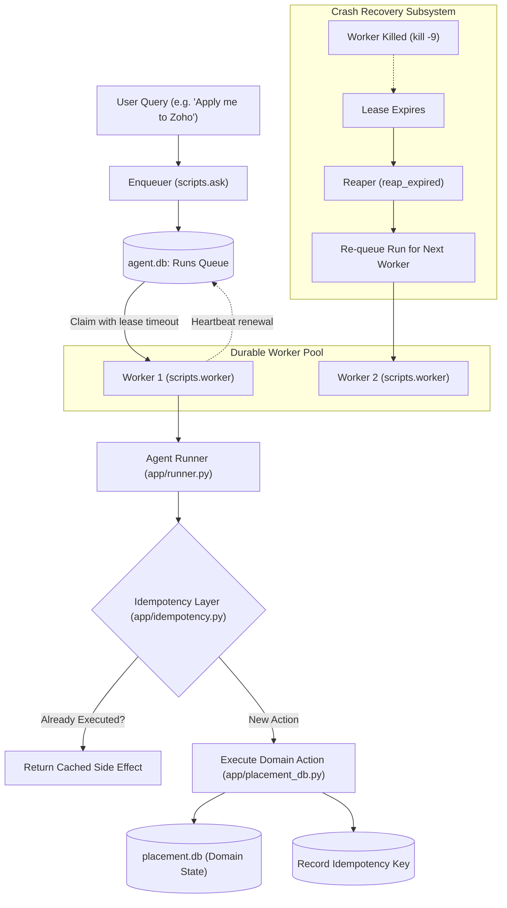

# ⚡ Durable Execution Engine & Fault-Tolerant Placement Agent

[](https://www.python.org/)
[]()
[](https://www.sqlite.org/)
[]()

> **Day 3 — Agentic AI Track**  
> Building an enterprise-grade durable execution runtime for AI agents featuring lease-based asynchronous worker queues, cryptographic idempotency keys, optimistic concurrency, and crash resilience drills.

---

## 📌 The Problem (What the Mentors Gave Me)

Real-world AI agents perform consequential actions in distributed environments:
- **Process Crashes**: A worker executing a multi-step tool call can be killed abruptly (`kill -9`, out-of-memory, server reboot) midway through execution.
- **Race Conditions**: Two workers might simultaneously pick up the same student application or attempt to book the exact same interview slot.
- **Duplicate Side Effects**: If an LLM retries an action or a network timeout occurs, re-running tools like `apply_to_drive` or `notify_student` could create duplicate database rows or send spam alerts to users.

The challenge was to build an engine where **runs are asynchronous jobs with leases**, **every side effect is strictly idempotent**, and **the system seamlessly recovers from abrupt crashes without human intervention**.

---

## 💡 My Solution & Architecture (What I Built)

I engineered a durable execution framework backed by two isolated SQLite databases (`agent.db` for operational worker leases and `placement.db` for domain transactions):



---

## 🛠️ What I Used (Tech Stack)

- **Language**: Python 3.10+
- **Dual SQLite Architecture**:
  - `agent.db`: Tracks conversation threads, messages, runs, steps, and worker heartbeats.
  - `placement.db`: College placement drives, students, applications, slots, notifications, and idempotency key stores.
- **Concurrency & Reliability**: Optimistic concurrency control (OCC), canonical JSON hashing (SHA-256 idempotency), and lease-based heartbeat locks.
- **Testing**: `pytest` test suite with 66 comprehensive automated tests (including crash drills, dead-lettering, and race tests).
- **LangChain Extension**: Modern tool-calling agent in `langchain-implementation/`.

---

## ✨ Features & What I Built

### 1. Lease-Based Asynchronous Worker Queue (`app/memory.py`)
- **`enqueue`**: Converts user questions into persistent queued jobs.
- **`claim_next`**: Workers atomically claim runs using expiration leases.
- **`heartbeat`**: Long-running jobs periodically renew their active lease.
- **`reap_expired`**: Abandoned jobs from crashed workers are re-queued automatically.

### 2. Cryptographic Idempotency System (`app/idempotency.py`)
- **Canonical JSON Hashing**: Serializes arguments deterministically, ignoring key ordering.
- **`PlacementDb.once()`**: Ensures that even if an LLM calls a tool 10 times in a row, the database mutation only occurs **once**, returning the identical cached payload on repeat attempts.

### 3. Safe Side Effects (`app/placement_db.py`)
- **Idempotent Applications**: Applying to an already-applied drive returns a clean success response rather than throwing a duplicate key exception.
- **Optimistic Slot Booking**: Concurrently contested interview slots resolve cleanly without double bookings.
- **Deduplicated Notifications**: Identical alerts to the same student within a window are suppressed.

### 4. Cancellation & Dead-Letter Queues
- Supports canceling queued runs mid-flight from a separate terminal.
- Jobs that repeatedly fail are moved to a dead-letter queue with structured error traces.

### 5. LangChain Agent Integration (`langchain-implementation/`)
- Implemented modern LangChain Tool-Calling agents (`create_tool_calling_agent` + `AgentExecutor`) alongside the native engine.

---

## 📂 Project Structure

```text
sodak-day-3/
├── app/
│   ├── idempotency.py           # Canonical JSON & cryptographic key hashing
│   ├── memory.py                # Job queue, leases, worker heartbeats & reaping
│   ├── placement_db.py          # Domain operations with idempotency guarantees
│   ├── runner.py                # Agent execution loop with tool guardrails
│   └── tools/
│       └── placement_tools.py   # Atomic tools for placement workflows
├── langchain-implementation/    # Sibling LangChain tool-calling implementation
│   ├── agent.py                 # LangChain Tool-Calling AgentExecutor
│   ├── cli.py                   # Interactive LangChain CLI
│   └── tools.py                 # Placement tools wrapped as LangChain @tool
├── schema/
│   ├── agent.sql                # Queue, run, and thread schema
│   └── placement.sql            # Domain schema with idempotency tables
├── scripts/
│   ├── ask.py                   # Enqueue questions to the worker queue
│   ├── worker.py                # Background queue worker process
│   ├── status.py                # Monitor queue status and side-effect counts
│   └── crash_drill.py           # Abrupt crash simulation (kill -9 resilience)
├── tests/                       # 66 comprehensive automated test cases
├── requirements.txt
└── README.md
```

---

## 🚀 How to Run & Verify

### 1. Setup Environment
```bash
python -m venv .venv
.venv\Scripts\activate       # On Linux/macOS: source .venv/bin/activate
pip install -r requirements.txt
```

### 2. Run All 66 Automated Tests
```bash
pytest tests/
```

### 3. Run Asynchronous Worker & Queue (In Two Terminals)
```bash
# Terminal 1: Start background worker
python -m scripts.worker --mock

# Terminal 2: Enqueue an application query
python -m scripts.ask "Apply me to Zoho"

# Inspect queue status and side effect metrics
python -m scripts.status
```

### 4. Run the Crash-and-Recovery Drill
```bash
# Spawns a worker, simulates a sudden kill -9 crash mid-run, and verifies automatic recovery
python -m scripts.crash_drill
```

---

## 📜 License
MIT License
