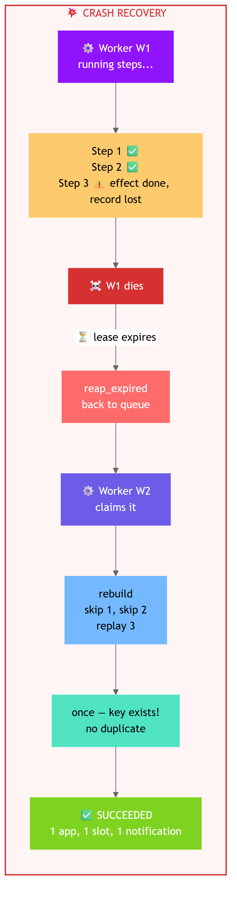
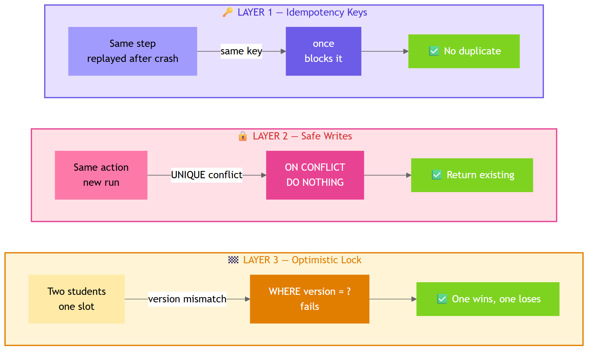

# Day 3 — Durable Execution

---

## Day 2 vs Day 3

### Day 2 — Simple Agent (crash = start over)


### Day 3 — Durable Agent (crash = recover and continue)


> Day 3 wraps Day 2's agent inside a **job queue** with **leases**, **crash recovery**, and **exactly-once side effects**.

---

## The Crash Recovery Flow



---

## Three Protection Layers



| Layer | Problem | Solution | Code |
|-------|---------|----------|------|
| **Idempotency Keys** | Same step replayed after crash | `once(key)` returns stored result | `placement_db.py → once()` |
| **Safe Writes** | Same action in a new run | `ON CONFLICT DO NOTHING` | `placement_db.py → create_application, record_notification` |
| **Optimistic Lock** | Two students, one slot | `WHERE version = ?` | `placement_db.py → claim_slot` |

---

## What You Write — File by File

### File 1: `app/memory.py` — The Job Queue

| Function | What it does | Key logic |
|----------|-------------|-----------|
| `enqueue()` | Student asks a question → save message + create queued run | ONE transaction, both or neither |
| `claim_next()` | Worker grabs oldest available job | `BEGIN IMMEDIATE` (write lock), `SELECT` + `UPDATE` in one transaction |
| `heartbeat()` | Worker says "I'm still alive" | `UPDATE lease_until WHERE lease_owner = me` |
| `reap_expired()` | Find dead workers, put their jobs back | `WHERE lease_until < now`, back to queued or dead |
| `request_cancel()` | User cancels a job | Queued → cancelled instantly. Running → set flag |
| `mark_cancelled()` | Worker sees the flag and stops | `UPDATE status = cancelled WHERE lease_owner = me` |
| `fail_attempt()` | A run failed — retry or give up? | Retryable → queued with backoff `2^(n-1) * 2s`. Used up → dead |

### File 2: `app/idempotency.py` — Fingerprints

| Function | What it does | Key logic |
|----------|-------------|-----------|
| `canonical_json()` | One spelling per meaning | Sorted keys, no spaces, `12.0` → `12` |
| `idempotency_key()` | Same call = same key | SHA-256 of `[run_id, step, tool, args]` |
| `notification_dedupe_key()` | Same message today = one notification | SHA-256 of `[student, message, date]`, whitespace collapsed |

### File 3: `app/placement_db.py` — Safe Side Effects

| Function | What it does | Key logic |
|----------|-------------|-----------|
| `once()` | Run effect at most once per key | Key exists → return stored. Key new → effect + key in ONE transaction |
| `create_application()` | Duplicate = success | `INSERT ... ON CONFLICT (student, drive) DO NOTHING` |
| `claim_slot()` | Race-safe booking | `UPDATE WHERE student_id IS NULL AND version = ?` |
| `record_notification()` | Dedup same-day messages | `INSERT ... ON CONFLICT (dedupe_key) DO NOTHING` |

### File 4: `app/runner.py` — The Agent Loop

| Function | What it does | Key logic |
|----------|-------------|-----------|
| `call_tool()` | Route tool calls | Side-effect → `once(key)`. Read-only → direct call |
| `between_steps()` | Check before each step | Cancel requested? → stop. Heartbeat failed? → `LeaseLost` |

### File 5: `tests/test_lab3_race.py` — Race Tests

| Test | What it proves |
|------|---------------|
| `test_two_workers_two_runs_one_slot` | Two workers race for slot 3. One books, one gets `slot_taken`. Both succeed. |
| `test_truly_concurrent_claims_have_one_winner` | 8 threads + Barrier. Exactly 1 wins, 7 lose. Version bumps by 1. |

---

## State Machine

```
         enqueue          claim_next             complete
  NEW ──────────▶ QUEUED ──────────▶ RUNNING ──────────▶ SUCCEEDED
                    ▲                  │ │ │
                    │  reap_expired    │ │ └─ fail(not retryable) ▶ FAILED
                    │  (lease expired) │ │
                    │  fail(retryable) │ └─ fail(used up) ──────▶ DEAD
                    └──────────────────┘
                                       └─ cancel ──────────────▶ CANCELLED
```

---

## Quick Test Commands

```bash
pytest tests/test_part1_queue.py          # Part 1: queue
pytest tests/test_part2_idempotency.py    # Part 2: idempotency
pytest tests/test_part3_safe_writes.py    # Part 3: safe writes
pytest tests/test_lab1_cancel.py          # Lab 1: cancel
pytest tests/test_lab2_dead_letter.py     # Lab 2: retry + dead-letter
pytest tests/test_lab3_race.py            # Lab 3: race tests
pytest tests/test_lab4_crash.py           # Lab 4: crash drill
pytest                                     # ALL — must be 66 passed
```
